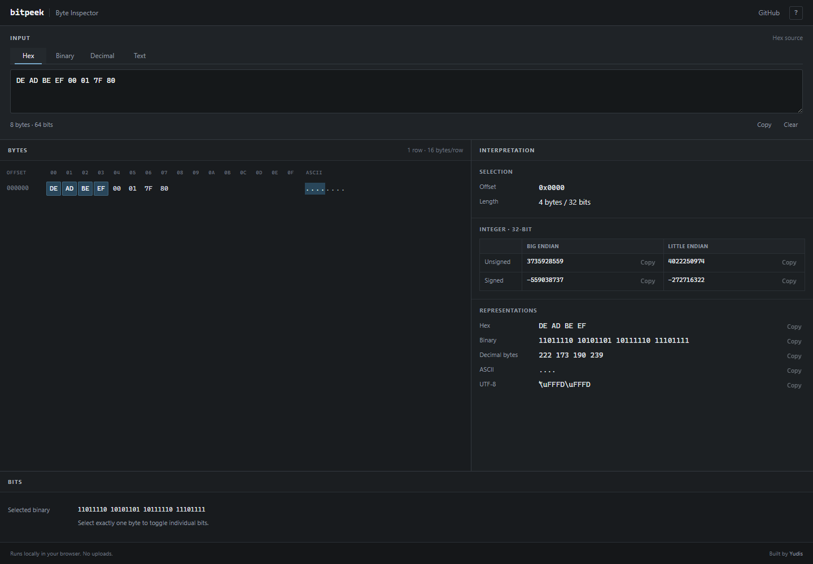

# bitpeek

A local-first byte inspector for hex, binary, integers, endianness, and text.

## Features

- Parse hex, binary, decimal bytes, and UTF-8 text
- Inspect offsets, ASCII, numeric values, endianness, and two's-complement values
- Select byte ranges with mouse or keyboard controls
- Toggle individual bits and keep the active source representation synchronized
- Copy selected representations without sending data anywhere

## Screenshot



## Local development

```sh
npm install
npm run dev
```

## Quality

```sh
npm test
npm run lint
npm run build
```

bitpeek is entirely client-side. No data leaves the browser.

## License

[MIT](LICENSE)
